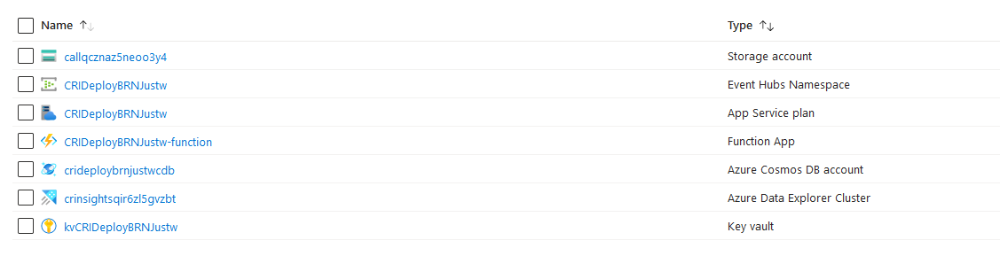

# Requirements

## Pre-Deployment Requirements
The Call Record Insights application requires the following steps to be completed before deploying.

- Existing Azure Subscription to deploy to
- Rights to create new resources in Azure Subscription
  - See [Deployment Permissions](#deployment-permissions) for details.
- Teams Enabled Users to generate call records

## Deployment Client Requirements
If using [deploy.ps1](../deploy/deploy.ps1), The workstation performing the deployment requires

- PowerShell 7.2 (or greater) or Windows PowerShell 5.1
- Azure Cli 2.56.0 or greater

## Azure Service Requirements
The following Azure Service components are required.

They will be created automatically as part of the deployment, either via [PowerShell](../deploy/deploy.ps1) or [ARM](../deploy/resourcemanager/template.json))

- 1 Azure Function app
- 1 Azure Storage Account
- 1 Azure Cosmos DB NoSQL Account
- 2 Azure Key vault minimum
- 1 Azure Event Hub
- 1 Azure Data Explorer Database
- 1 App Service Plan

*Example Resource Group (Post-Deployment):*

## Permissions

### Runtime Permissions

| **Account Needing Permissions** | **Role** | **Minimum Required Scope** | **Automated Assignment Source** | **Reason For Requirement** |  |
|---|---|---|---|---|---|
| Kusto Managed Identity | Cosmos DB Account Reader | Cosmos DB Account | [configureKusto.bicep](../deploy/bicep/configureKusto.bicep) | Configuring Kusto Ingestion | [<u>ref</u>](https://learn.microsoft.com/en-us/azure/data-explorer/ingest-data-cosmos-db-connection?tabs=arm&tabpanel_1_arm) |
|  | Cosmos DB Data Reader | Cosmos DB "records" container | [configureKusto.bicep](../deploy/bicep/configureKusto.bicep) | Reading data from "records" to ingest | [<u>ref</u>](https://learn.microsoft.com/en-us/azure/data-explorer/ingest-data-cosmos-db-connection?tabs=arm&tabpanel_1_arm) |
| Function App Managed Identity | Storage Account Contributor | Storage Account | [configureKusto.bicep](../deploy/bicep/configureKusto.bicep) |  | [<u>ref</u>](https://learn.microsoft.com/en-us/azure/azure-functions/functions-reference?tabs=eventhubs&pivots=programming-language-csharp&connecting-to-host-storage-with-an-identity) |
|  | Storage Account Queue Data Contributor | Storage Account | [deployFunction.bicep](../deploy/bicep/deployFunction.bicep) | Queue Trigger | [<u>ref</u>](https://learn.microsoft.com/en-us/azure/azure-functions/functions-reference?tabs=queue&pivots=programming-language-csharp&tabpanel_1_queue) |
|  | Storage Account Blob Data Owner | Storage Account | [deployFunction.bicep](../deploy/bicep/deployFunction.bicep) |  | [<u>ref</u>](https://learn.microsoft.com/en-us/azure/azure-functions/functions-reference?tabs=eventhubs&pivots=programming-language-csharp&connecting-to-host-storage-with-an-identity) |
|  | Event Hubs Data Receiver | Event Hub | [deployFunction.bicep](../deploy/bicep/deployFunction.bicep) | Event Hubs Trigger | [<u>ref</u>](https://learn.microsoft.com/en-us/azure/azure-functions/functions-reference?tabs=eventhubs&pivots=programming-language-csharp&tabpanel_1_eventhubs) |
|  | Key Vault Secrets Officer | Key Vault | [deployFunction.bicep](../deploy/bicep/deployFunction.bicep) | Function Secrets | [<u>ref</u>](https://learn.microsoft.com/en-us/azure/azure-functions/functions-reference?tabs=eventhubs&pivots=programming-language-csharp&connecting-to-host-storage-with-an-identity) |
|  | Cosmos DB Data Contributor | Cosmos DB Database | [deployFunction.bicep](../deploy/bicep/deployFunction.bicep) | Read/Upsert Processed Data | [<u>ref</u>](https://learn.microsoft.com/en-us/azure/cosmos-db/how-to-setup-rbac#built-in-role-definitions) |
|  | CallRecords.Read.All | Microsoft Graph (Tenant) | [deploy.ps1](../deploy/deploy.ps1) | Configure Subscription Retrieve Call Records | [<u>ref</u>](https://learn.microsoft.com/en-us/graph/permissions-reference#callrecordsreadall) |
| Microsoft Graph Change Tracking Service Principal | Key Vault Secrets User | Graph Event Hub Connection String Secret | [deployFunction.bicep](../deploy/bicep/deployFunction.bicep) | Read Event Hub connection string for event publishing | [<u>ref</u>](https://learn.microsoft.com/en-us/graph/change-notifications-delivery-event-hubs#receiving-notifications) |

### Deployment Permissions

The recommendation is to grant all of these permissions to a single user account performing the deployment, and to use [deploy.ps1](../deploy/deploy.ps1)

> [!Note]
> Regarding Multiple Administrator Deployment
>
> This can be done, however, this will result in errors on each run of [deploy.ps1](../deploy/deploy.ps1) where the running account does not have all permissions
> - The parameters passed to [deploy.ps1](../deploy/deploy.ps1) **MUST** be the same for each run, regardless of the admin account
> - When the [deploy.ps1](../deploy/deploy.ps1) script writes an error regarding checking permissions, then the current account does not have the required permissions to continue
> - The step which failed will be noted as the last line before the error
> - So long as the final run of the [deploy.ps1](../deploy/deploy.ps1) script results in no errors, then the application will have deployed successfully

#### Permissions Required for deploy.ps1

> [!Note]
> All Commands tested using Azure Cli version 2.56.0

Below is a break down of each underlying Azure Cli command which is used in the script. Each Command has the list of Possible Errors you may see if permissions are not set properly for the currently signed-in user.

##### Command

`az account show --query id`

###### Possible Errors

- `Failed to connect to subscription '$SubscriptionId'. Please ensure you have access to the subscription and try again.`

###### API Calls

- None

###### Permissions

- No additional permissions

##### Command

`az ad signed-in-user show --query userPrincipalName az ad signed-in-user show --query id`

###### Possible Errors

- `Failed to get identity of signed in user! Please ensure you are signed in and try again.`

###### API Calls

- GET https://graph.microsoft.com/v1.0/me

###### Permissions

- Microsoft Graph Scopes ([ref](https://learn.microsoft.com/en-us/graph/api/user-get#permissions))
  - User.Read
  - **OR**
  - User.ReadWrite
  - **OR**
  - User.ReadBasic.All
  - **OR**
  - User.Read.All
  - **OR**
  - User.ReadWrite.All
  - **OR**
  - Directory.Read.All
  - **OR**
  - Directory.ReadWrite.All

##### Command

`az account show --query tenantId`

###### Possible Errors

- `Failed to get tenant id for subscription '$SubscriptionId'. Please ensure you have access to the subscription and try again.`

###### API Calls

- None

###### Permissions

- Must Be User in Tenant associated with Subscription
- No additional permissions

##### Command

`az ad sp list --spn $APP_ID --query "[].id"`

###### Possible Errors

- `Failed to get the SPN object id for the Microsoft Graph Change Tracking app. Please ensure you have access to the tenant and try again.`

- `Failed to get the SPN object id for Microsoft Graph. Please ensure you have access to the tenant and try again.`

###### API Calls

- GET https://graph.microsoft.com/v1.0/servicePrincipals?$filter=servicePrincipalNames/any(c:c/id+eq+'$APP_ID')

###### Permissions

- Microsoft Graph Scopes ([ref](https://learn.microsoft.com/en-us/graph/api/serviceprincipal-list#permissions))
  - Application.Read.All
  - **OR**
  - Application.ReadWrite.All
  - **OR**
  - Directory.Read.All
  - **OR**
  - Directory.ReadWrite.All

##### Command

`az group show --name $RESOURCE_GROUP`

###### Possible Errors

- `Failed to create resource group '$ResourceGroupName' in location '$Location'. Please ensure you have access to the subscription and try again.`

###### API Calls

- GET https://management.azure.com/subscriptions/$SUBSCRIPTION_ID/resourcegroups/$RESOURCE_GROUP?api-version=2022-09-01

###### Permissions

- Azure RBAC Roles
  - Microsoft.Resources/subscriptions/resourceGroups/read

##### Command

`az group create --name $RESOURCE_GROUP --location $LOCATION`

###### Possible Errors

- `Failed to create resource group '$ResourceGroupName' in location '$Location'. Please ensure you have access to the subscription and try again.`

###### API Calls

- PUT https://management.azure.com/subscriptions/$SUBSCRIPTION_ID/resourcegroups/$RESOURCE_GROUP?api-version=2022-09-01

###### Permissions

- Azure RBAC Roles
  - Microsoft.Resources/subscriptions/resourceGroups/read
  - **AND**
  - Microsoft.Resources/subscriptions/resourceGroups/write

##### Command

`az rest --method get --url "https://graph.microsoft.com/v1.0/servicePrincipals/$SPN_ID/appRoleAssignments"`

###### Possible Errors

- `Failed to add app role '$perm' to Service Principal '$appPrincipalprincipalId'. Please ensure you have access to the tenant and try again.`

###### API Calls

- GET https://graph.microsoft.com/v1.0/servicePrincipals/$SPN_ID/appRoleAssignments

###### Permissions

- Microsoft Graph Scopes ([ref](https://learn.microsoft.com/en-us/graph/api/serviceprincipal-list-approleassignments#permissions))
  - Application.Read.All
  - **OR**
  - Application.ReadWrite.All
  - **OR**
  - Directory.Read.All
  - **OR**
  - Directory.ReadWrite.All

##### Command

`az rest --method post --url "https://graph.microsoft.com/v1.0/servicePrincipals/$SPN_ID/appRoleAssignments" --body "$body"`

###### Possible Errors

- `Failed to add app role '$perm' to Service Principal '$appPrincipalprincipalId'. Please ensure you have access to the tenant and try again.`

###### API Calls

- POST https://graph.microsoft.com/v1.0/servicePrincipals/$SPN_ID/appRoleAssignments

###### Permissions

- Microsoft Graph Scopes ([ref](https://learn.microsoft.com/en-us/graph/api/serviceprincipal-post-approleassignments#permissions))
  - AppRoleAssignment.ReadWrite.All
  - **AND**
  - Application.Read.All
  - **OR**
  - Directory.Read.All

##### Command

`az webapp log deployment show --resource-group $RESOURCE_GROUP --name $FUNCTION_APP`

###### Possible Errors

- `Failed to get deployment logs for function app '$functionName'. Please ensure you have access to the subscription and try again.`

###### API Calls

- GET https://management.azure.com/subscriptions/$SUBSCRIPTION_ID/resourceGroups/$RESOURCE_GROUP/providers/Microsoft.Web/sites/$FUNCTION_APP?api-version=2023-01-01
- GET https://management.azure.com/subscriptions/$SUBSCRIPTION_ID/resourceGroups/$RESOURCE_GROUP/providers/Microsoft.Web/sites/$FUNCTION_APP/basicPublishingCredentialsPolicies/scm?api-version=2023-01-01
- POST https://management.azure.com/subscriptions/$SUBSCRIPTION_ID/resourceGroups/$RESOURCE_GROUP/providers/Microsoft.Web/sites/$FUNCTION_APP/config/publishingcredentials/list?api-version=2023-01-01

###### Permissions

- Azure RBAC Roles
  - Microsoft.Web/sites/Read
  - **AND**
  - Microsoft.Web/sites/basicPublishingCredentialsPolicies/scm/Read
  - **AND**
  - Microsoft.Web/sites/config/list/Action

##### Command

`az functionapp keys list --resource-group $RESOURCE_GROUP --name $FUNCTION_APP --query masterKey`

###### Possible Errors

- `Failed to get master key for function app '$functionName'.`

###### API Calls

- POST https://management.azure.com/subscriptions/$SUBSCRIPTION_ID/resourceGroups/$RESOURCE_GROUP/providers/Microsoft.Web/sites/$FUNCTION_APP/host/default/listkeys?api-version=2023-01-01

###### Permissions

- Azure RBAC Roles
  - Microsoft.Web/sites/host/listkeys/action

##### Command

`az deployment group show --resource-group $RESOURCE_GROUP --name $DEPLOYMENT_NAME --query properties`

###### Possible Errors

- `Could not get $DeploymentType deployment in resource group '$ResourceGroupName'. Please ensure you have access to the subscription and try again.`
- `Failed to create $DeploymentType in resource group '$ResourceGroupName'. Please ensure you have access to the subscription and try again.`

###### API Calls

- GET https://management.azure.com/subscriptions/$SUBSCRIPTION_ID/resourcegroups/$RESOURCE_GROUP/providers/Microsoft.Resources/deployments/$DEPLOYMENT_NAME?api-version=2022-09-01

###### Permissions

- Azure RBAC Roles
  - Microsoft.Resources/deployments/read

##### Command

`az deployment group create --resource-group $RESOURCE_GROUP --name $DEPLOYMENT_NAME --mode Incremental --template-file $TemplateFile --no-prompt true --no-wait --query properties --parameters ...`

###### Possible Errors

- `Failed to create $DeploymentType in resource group '$ResourceGroupName'. Please ensure you have access to the subscription and try again.`

###### API Calls

- POST https://management.azure.com/subscriptions/$SUBSCRIPTION_ID/resourcegroups/$RESOURCE_GROUP/providers/Microsoft.Resources/deployments/$DEPLOYMENT_NAME?api-version=2022-09-01

###### Permissions

- Azure RBAC Roles
  - Microsoft.Resources/deployments/write

##### Command

`az deployment operation group list --resource-group $RESOURCE_GROUP --name $DEPLOYMENT_NAME --query "[].{provisioningState:properties.provisioningState,targetResource:properties.targetResource.id,statusMessage:properties.statusMessage.error.message}"`

###### Possible Errors

- `Failed to create $DeploymentType in resource group '$ResourceGroupName'. Please ensure you have access to the subscription and try again.`

###### API Calls

- GET https://management.azure.com/subscriptions/$SUBSCRIPTION_ID/resourcegroups/$RESOURCE_GROUP/providers/Microsoft.Resources/deployments/$DEPLOYMENT_NAME/operations?api-version=2022-09-01

###### Permissions

- Azure RBAC Roles
  - Microsoft.Resources/deployments/operations/read

#### Permissions for Resource Deployment

> [!Note]
> Each role requires at least resource group level scoped assignment

> [!Note]
> These roles are required whether deploying via [deploy.ps1](../deploy/deploy.ps1) **OR** [ARM](../deploy/resourcemanager/template.json)

| **Bicep Template** | **Azure RBAC Roles** |
|---|---|
| [deployKusto.bicep](../deploy/bicep/deployKusto.bicep) | Microsoft.Kusto/clusters/read Microsoft.Kusto/clusters/create Microsoft.Kusto/clusters/databases/create |
| [deployCosmos.bicep](../deploy/bicep/deployCosmos.bicep) | Microsoft.DocumentDB/databaseAccounts/create Microsoft.DocumentDB/databaseAccounts/sqlDatabases/containers/create Microsoft.DocumentDB/databaseAccounts/sqlDatabases/create |
| [deployFunction.bicep](../deploy/bicep/deployFunction.bicep) | Microsoft.DocumentDB/databaseAccounts/read Microsoft.DocumentDB/databaseAccounts/sqlDatabases/read Microsoft.DocumentDB/databaseAccounts/sqlDatabases/containers/read Microsoft.EventHub/namespaces/read Microsoft.KeyVault/vaults/read Microsoft.KeyVault/vaults/secrets/read Microsoft.Storage/storageAccounts/read Microsoft.Web/sites/read Microsoft.Authorization/roleAssignments/create Microsoft.DocumentDB/databaseAccounts/sqlRoleAssignments/create Microsoft.EventHub/namespaces/create Microsoft.EventHub/namespaces/eventhubs/authorizationRules/action Microsoft.EventHub/namespaces/eventhubs/authorizationRules/create Microsoft.EventHub/namespaces/eventhubs/create Microsoft.KeyVault/vaults/create Microsoft.KeyVault/vaults/secrets/create Microsoft.Storage/storageAccounts/action Microsoft.Storage/storageAccounts/create Microsoft.Storage/storageAccounts/queueServices/create Microsoft.Storage/storageAccounts/queueServices/queues/create Microsoft.Web/serverfarms/create Microsoft.Web/sites/config/create Microsoft.Web/sites/create |
